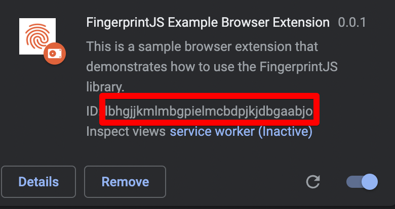

# FingerprintJS Pro Chrome Extension Example

This repository contains example browser extension that uses the FingerprintJS Pro Agent.

### Why it exists

Due to limitations in browser extension environment regarding executing remote code, the Pro Agent doesn't work there by default, because it loads its main script via CDN.

### How it works

The solution is split into two parts - **chrome-extension** and **website**.

#### Website

Website uses the Pro Agent as it normally would, and communicates with browser extension using [native communication channel](https://developer.chrome.com/docs/extensions/mv3/messaging/#external-webpage).

#### Chrome Extension

When extension needs to obtain data from the Pro Agent, it creates a new window with URL of the **website** and waits for new messages from it.

1. We send message to background script `{"type": "get-fingerprint"}`.
2. Background creates a new window that points to the **website** url.
3. **website** uses the Pro Agent to obtain data, and passes it back to chrome extension via `chrome.runtime.sendMessage`.
4. Background scripts waits for the message, and then passes it back to the sender.
5. Created window is closed.

**Note:** Implementation of this solution is not perfect, ideally it should also handle time-out scenerios and connection issues with the website, but it was decided to leave it out in order to keep it simple.

### Development

After cloning the repository perform these operations:

* Run `yarn install` to install dependencies
* Copy `.env.dist` to `.env` and provide your FingerprintJS Public `API_KEY`
  * If you want to develop the extension locally, you also need to set `WEBSITE_URL=https://localhost:8080/`
  * You will also need to set the `EXTENSION_IDS`, we will get back to it later.
* Run `yarn extension:watch` to build the extension on changes
* Install the unpacked extension in your browser. In order to do that:
  * Head to **Manage Extensions** page in your browser
  * Click **Load unpacked**
  * Select `packages/chrome-extension/build` directory
  * You should see the **FingerprintJS Example Browser Extension** extension, make sure that it is activated.
  * Copy the `extension ID`: 
  * Paste it into `.env` as `EXTENSION_IDS`
* Run `yarn website:start` to run the website
  * **Note**: Required `chrome` API is not available on pages that are not served via `https`, so the website is served on `https://localhost:8080/`. You can safely ignore the warning regarding certificate.
