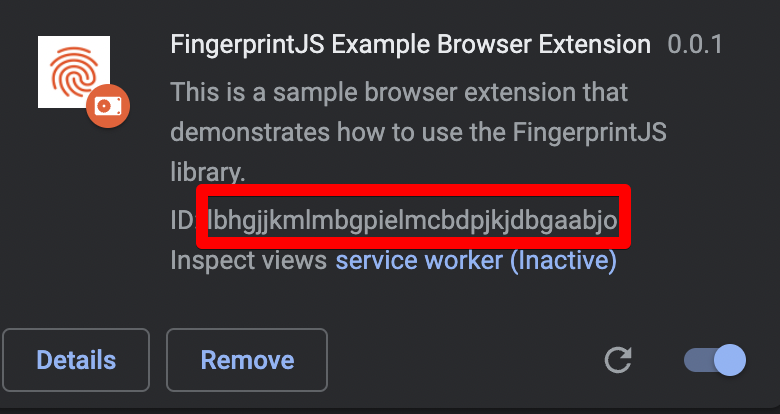

  <a href="https://fingerprint.com">
    <picture>
     <source media="(prefers-color-scheme: dark)" srcset="https://raw.githubusercontent.com/fingerprintjs/fingerprintjs-pro-chrome-extension-example/main/resources/logo_light.svg" />
     <source media="(prefers-color-scheme: light)" srcset="https://raw.githubusercontent.com/fingerprintjs/fingerprintjs-pro-chrome-extension-example/main/resources/logo_dark.svg" />
     
   </picture>
  </a>

  

# Fingerprint Pro Chrome Extension Example

Fingerprint is a device intelligence platform offering 99.5% accurate visitor identification.

This repository contains an example Chrome extension that uses the Fingerprint Pro JavaScript agent.

## Requirements

- Chromium-based browser (Chrome, Edge, Opera, etc.)

## Installation

You can install the example chrome extension from [Chrome Web Store](https://chrome.google.com/webstore/detail/fingerprintjs-example-bro/knppbjgkegnlbhddedbilnfmnkdocekn).

## How it works

The Chrome extension environment has limited capabilities for external scripts running within content scripts.
The solution is split into two parts - **chrome-extension** and **website**.

## Website

The website uses the Fingerprint Pro JavaScript agent as it normally would, and communicates with the Chrome extension.
It is hosted on [Github Pages](https://fingerprintjs.github.io/fingerprintjs-pro-chrome-extension-example/).

## Chrome Extension

Provides a sample extension that consists of a popup page, background, and content script.

This repository contains two strategies that make our FingerprintJS Pro JavaScript agent work in the Chrome extension environment.

### New window

When the extension needs to obtain data from the FingerprintJS Pro JavaScript agent, it creates a new window (via `chrome.windows.create`) with the URL of the **website** and waits for a message from it.

1. We send message to background script `{"type": "get-visitor-id"}`.
2. The background script creates a new window that points to the **website** URL. The window is visible but without focus.
3. The **website** uses the FingerprintJS Pro JavaScript agent to obtain data and passes it back to the Chrome extension via [native communication channel](https://developer.chrome.com/docs/extensions/mv3/messaging/#external-webpage).
4. The background scripts wait for the message and then pass it back to the sender.
5. Created window is closed.

> To debug the created window, you can comment out the `await chrome.windows.remove(currentWindow.id);` in `closeCurrentWindow` function in `packages/chrome-extension/src/background.ts`.

This strategy can be found in `packages/chrome-extension/src/fingerprint/strategies/newWindow.strategy.ts`.

### Iframe

1. We append an iframe to the DOM of a currently open page in the browser with the URL of the **website**. It can be used in the extension popup as well.
2. The **website** uses the FingerprintJS Pro JavaScript agent to obtain data, and passes it back to the parent window via `window.parent.postMessage`.
3. The **chrome-extension** awaits the message.

This strategy can be found in `packages/chrome-extension/src/fingerprint/strategies/iframe.strategy.ts`.

---

**Note:** Implementation of both of these strategies is not perfect, ideally they should also handle time-out scenarios and connection issues with the website. It was decided to leave it out to keep it simple.

## Development

After cloning the repository perform these operations:

- Run `pnpm install` to install dependencies.
- Copy `.env.dist` to `.env` and provide your FingerprintJS Public `API_KEY`.
  - If you want to develop the extension locally, you also need to set `WEBSITE_URL=https://localhost:8080/`.
  - You will also need to set the `EXTENSION_IDS`, we will get back to it late.
- Run `pnpm extension:watch` to build the extension on changes.
- Install the unpacked extension in your browser. To do that:
  - Head to `chrome://extensions/` page in your browser.
  - Click **Load unpacked**.
  - Select `packages/chrome-extension/build` directory.
  - You should see the **FingerprintJS Example Browser Extension** extension, make sure that it is activated.
  - Copy the `extension ID`: 
  - Paste it into `.env` as `EXTENSION_IDS`. It is needed, so that the **website** can communicate with the extension.
- Run `pnpm website:start` to run the website.
  - **Note**: Required `chrome` API for **New window** strategy is not available on pages that are not served via `HTTPS`, so the website is served on `https://localhost:8080/`. You can safely ignore the warning regarding the certificate.
  - In order to use the [Custom subdomain](https://dev.fingerprint.com/docs/subdomain-integration) set `API_ENDPOINT=YOUR_API_ENDPOINT` in `.env`.

## Support and feedback
To ask questions or provide feedback, use [Issues](https://github.com/fingerprintjs/fingerprintjs-pro-chrome-extension-example/issues). If you need private support, please email us at `oss-support@fingerprint.com`.

## License
This project is licensed under the MIT license. See the [LICENSE](https://github.com/fingerprintjs/fingerprintjs-pro-chrome-extension-example/blob/main/LICENSE) file for more info.
